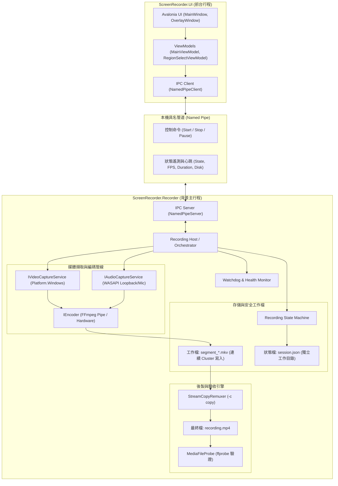
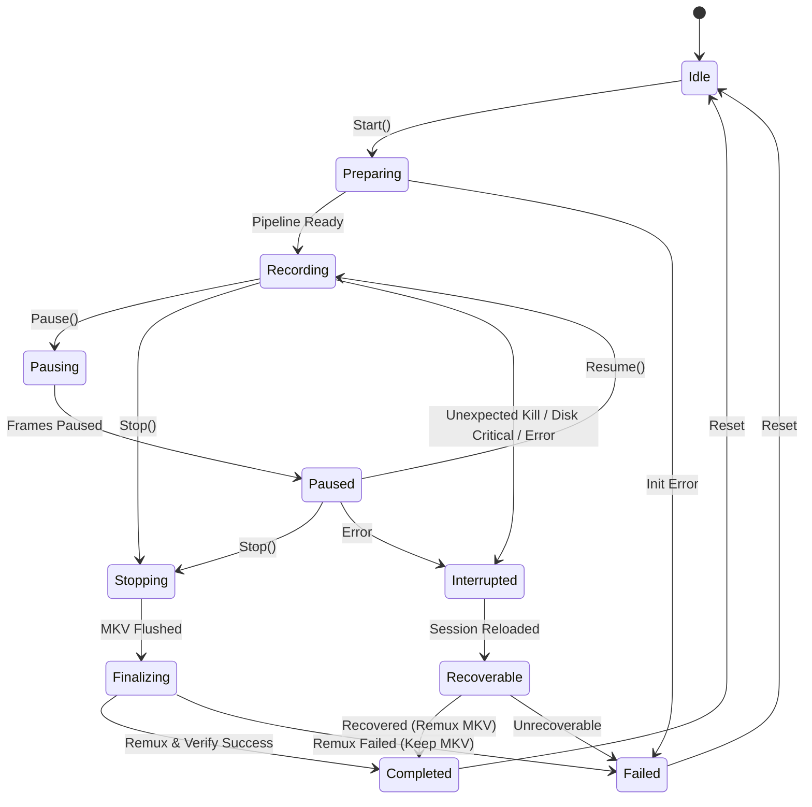

# 螢幕錄影專案系統架構 (System Architecture)

本文件定義本專案之整體架構、元件分層、行程分離模型、狀態機轉移規則及跨平台抽象界線。

---

## 1. 系統架構總覽 (Overview)

系統採用**前端 UI 與背景 Recorder 雙行程分離架構**，兼顧操作親和力與錄影極限可靠性：



---

## 2. 專案分層與責任分工

```text
ScreenRecorder.sln
├── src/
│   ├── ScreenRecorder.Core/               [跨平台核心 (完全無 Windows API)]
│   ├── ScreenRecorder.Infrastructure/     [通訊、日誌、磁碟監控]
│   ├── ScreenRecorder.Media/              [FFmpeg 串流、Remux、ffprobe 探針]
│   ├── ScreenRecorder.Platform.Windows/   [Windows.Graphics.Capture, WASAPI, Win32]
│   ├── ScreenRecorder.Recorder/           [背景錄影主機 Host]
│   └── ScreenRecorder.UI/                 [Avalonia 桌面 UI 與選區 Overlay]
└── tests/
    ├── ScreenRecorder.Core.Tests/
    └── ScreenRecorder.Media.Tests/
```

### 嚴格依賴原則 (Dependency Rules)
1. **Core 專案**不得引用任何 Windows 專用 API 或命名空間（如 `Windows.Graphics.Capture`、`System.Windows.Forms`、`Microsoft.Win32`）。
2. **Platform.Windows** 專案實作 Core 所定義之抽象介面 (`IVideoCaptureService`, `IAudioCaptureService`, `IDisplayService`)。
3. **UI 專案**不得直接包含擷取或編碼的底層程式碼，所有錄影控制與狀態取得皆透過 IPC 呼叫。

---

## 3. 錄影狀態機 (Recording State Machine)

狀態機嚴格管理錄影的生命週期，杜絕多執行緒下使用大量 `bool` 旗標造成的競爭條件 (Race Condition)：



### 狀態清單與意義
- `Idle`: 閒置待命。
- `Preparing`: 初始化影音裝置、配置工作目錄、寫入初版 `session.json`。
- `Recording`: 正在進行畫面擷取、音訊採樣與持續寫入 MKV。
- `Pausing` / `Paused`: 暫停狀態（暫時停止寫入新幀，保持管線開啟）。
- `Stopping`: 停止錄影請求中，不再接收新畫面，將內部緩衝區之影音殘餘資料完整 Flush 至 MKV。
- `Finalizing`: MKV 工作檔已安全關閉，正在執行 `MKV → MP4` 之無損 Remux 與 `ffprobe` 檢驗。
- `Completed`: 錄影流程正常完成，MP4 檔案產生且檢驗合格。
- `Interrupted`: 遭遇非預期例外、設備全失、磁碟不足或外部程序終止。
- `Recoverable`: 重新啟動時發現存在上次未完成之 Session，已建立救援資訊。
- `Failed`: 發生無法完成目前流程的重大錯誤；原始 MKV 仍予保留，供檢查或修復救援。

---

## 4. 行程分離與具名管道通訊 (IPC)

### 行程角色
1. **ScreenRecorder.UI**
   - 負責渲染使用者介面（解析度、FPS、音訊來源選擇、自訂框選 Overlay）。
   - 透過具名管道 `\\.\pipe\ScreenRecorder_{UserSession}` 連接 Recorder。
   - 每 500ms 發送 Ping，並接收 Recorder 回報之遙測數據（錄影秒數、檔案大小、磁碟剩餘空間、當前狀態）。
2. **ScreenRecorder.Recorder**
   - Headless 行程，掌控所有非同步任務與底層資源生命週期。
   - 具備獨立的 Unhandled Exception 捕捉與日誌記錄。
   - Recorder 以 `--parent-pid` 監看啟動它的 UI 行程。若 UI 意外或異常結束，Recorder 會取消常駐工作，要求目前錄影安全停止、收尾 MKV 並嘗試完成封裝後才退出；不會在 UI 消失後無限背景錄影。
   - 遙測中的影像、編碼器、系統聲音與麥克風健康欄位都是可空值：`null` 表示尚無足夠觀察資料，`true` 表示已觀察到正常進度，`false` 才是已確認異常。未選用的音訊來源保持 `null`，不得誤報正常或故障。

---

## 5. 跨平台抽象界限 (Windows vs macOS)

| 功能領域 | 核心抽象介面 (Core) | Windows 實作 (Platform.Windows) | macOS 實作 (Platform.macOS) |
| :--- | :--- | :--- | :--- |
| **畫面擷取** | 錄影組態與 FFmpeg 平台參數 | Windows Graphics/GDI 相容路徑 | AVFoundation（透過 FFmpeg）輸入 |
| **系統聲音** | `ISystemAudioLoopbackCapture` | WASAPI Loopback | ScreenCaptureKit Audio |
| **麥克風聲音** | `IMicrophoneCapture` | Windows 音訊裝置路徑 | `AVAudioEngine` → 私有 PCM FIFO → FFmpeg |
| **螢幕與 DPI** | `IDisplayService` | Win32 顯示器列舉 | NSScreen + CGDisplay |
| **檔案轉碼** | `IStreamCopyRemuxer` | FFmpeg Process (`-c copy`) | FFmpeg Process (`-c copy`) |
| **音畫探針** | `IMediaProbeService` | ffprobe Process | ffprobe Process |
