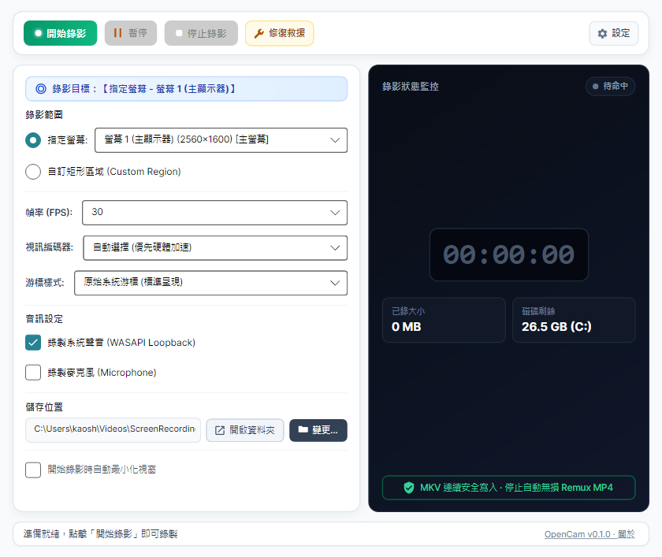
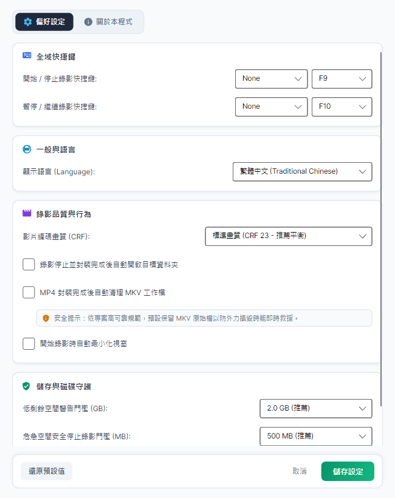
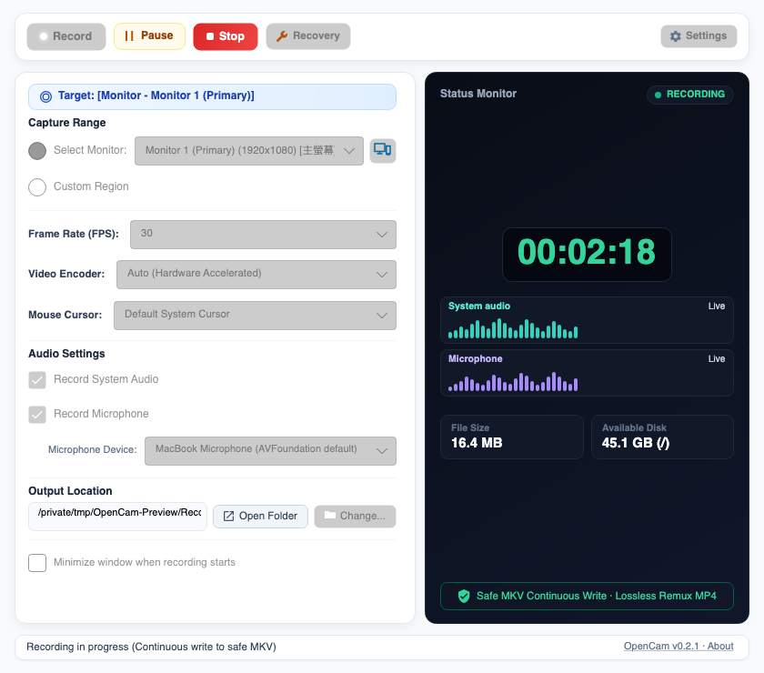
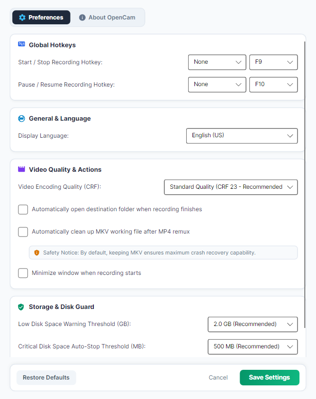

# OpenCam（螢幕錄影工具）🎥

[](https://github.com/kaoshou/OpenCam/releases/latest)
[](https://github.com/kaoshou/OpenCam/actions/workflows/build-and-release.yml)
[](https://opensource.org/licenses/Apache-2.0)

*（English version below）*

OpenCam 是一款以可靠性為優先的跨平台桌面螢幕錄影工具。錄影期間以 MKV 作為安全工作檔，正常停止後再無損封裝為 MP4，以降低當機、停電或音訊裝置異常時的資料損失風險。

本軟體以 .NET 8 與 Avalonia UI 打造，並使用 FFmpeg 作為核心多媒體引擎，支援 Windows 與 macOS。

📖 [完整使用說明（繁體中文）](docs/USER_GUIDE.zh-TW.md) ｜ [English User Guide](docs/USER_GUIDE.en-US.md)

> 以下為 Windows 介面預覽；macOS 使用相同的主要操作流程。




## v0.1.5 重點更新

- 修正錄影畫質、磁碟警告門檻與成功封裝後清理 MKV 等偏好設定未完整套用到 Recorder 的問題。
- 修正錄影正常停止後，UI 可能因最後狀態訊息而誤判為中斷的問題。
- 暫停後變更系統聲音、麥克風與游標設定時，會正確傳遞到下一個錄影片段。
- 新增繁體中文與英文完整使用說明，涵蓋錄影模式、參數、檔案機制、設定、工作檔位置及修復救援流程。
- 重整 Crash Recovery：支援目前的 `segment_*.mkv` 分段與舊版 `recording.mkv` 工作檔。
- 工作階段中繼資料遺失或損壞時，可由現存 MKV 分段重建並嘗試救援。
- 損壞或空白尾段不再阻擋整次救援；OpenCam 會保留可讀的連續內容，並清楚標示部分救回。
- 錄影、暫停、停止及 MP4 封裝期間持續更新工作階段心跳，避免把仍在執行的錄影誤判為可救援內容。
- 改善 MKV 寫入與 MP4 無損封裝的取消、長影片、特殊路徑及多實例安全性；所有原始 MKV 均會保留。
- 救援期間鎖定開始錄影與相關設定，並顯示完整救回、部分救回與失敗的正確統計。
- 錄影、暫停或初始化期間關閉程式時會顯示提醒並取消關閉，避免意外中斷錄影。
- 官方封裝優先使用 App 內附的 FFmpeg 與 FFprobe，避免系統 PATH 中的其他版本造成相容性問題。
- 修正 macOS 無音訊錄影時 FFmpeg 參數順序錯誤，指定螢幕與自訂區域皆可正常開始錄影。

完整安裝檔請至 [OpenCam v0.1.5 Release](https://github.com/kaoshou/OpenCam/releases/tag/v0.1.5) 下載。

## 🌟 核心特色

- **指定螢幕與自訂區域**：可選擇要錄製的顯示器，或使用透明且可調整大小的選取框指定錄影範圍。
- **系統聲音與麥克風**：可分別開啟或關閉系統聲音及麥克風，並支援四種音訊組合。
- **游標效果**：可使用原始游標、光暈、光暈加點擊漣漪，或在影片中隱藏游標。
- **防中斷安全機制（Crash Recovery）**：強制使用 MKV 作為工作檔；若錄影途中斷電或崩潰，下次啟動可嘗試恢復已寫入的內容。
- **音訊熱拔插防護（Audio Hotplug Watchdog）**：Windows 錄影途中若麥克風中斷，系統會使用虛擬靜音音軌盡可能維持錄影流程。
- **暫停期間調整**：暫停錄影後可調整系統聲音、麥克風開關及游標樣式；錄影來源、解析度、FPS 等固定設定仍保持鎖定。
- **硬體加速支援（Hardware Encoding）**：支援 NVIDIA NVENC、Intel QSV、AMD AMF 以及 Apple VideoToolbox，並在不可用時回退至 CPU 編碼。
- **自動無損轉檔**：錄影正常結束後自動使用 Stream Copy，將 MKV 快速封裝（Remux）為 MP4，不重新編碼影片。
- **磁碟守護機制（Disk Monitor）**：磁碟空間不足前發出警告，並在臨界點嘗試安全停止，降低檔案損毀風險。
- **跨平台**：支援 Windows 10/11 x64，以及搭載 Apple Silicon 的 macOS 13 Ventura 或以上版本。

## 🚀 系統需求與安裝

### Windows 10/11（x64）

- 前往 [Releases](https://github.com/kaoshou/OpenCam/releases) 頁面。
- 下載 `OpenCam_*_Setup.exe`（安裝版）或 `OpenCam_Windows_Portable.zip`（免安裝版）。
- 執行應用程式。套件已包含所需的 .NET Runtime，無須另外安裝。

### macOS 13 Ventura 或以上（Apple Silicon／arm64）

> v0.1.5 尚未提供 Intel Mac（x64）版本。

- 前往 [Releases](https://github.com/kaoshou/OpenCam/releases) 頁面並下載 `OpenCam_macOS_AppleSilicon.dmg`。
- 打開 DMG，將 `OpenCam.app` 拖曳至「應用程式（Applications）」資料夾。
- 第一次啟動時，請依 macOS 提示在「系統設定 → 隱私權與安全性」中允許 OpenCam 使用「螢幕與系統音訊錄製」及「麥克風」。變更權限後若功能尚未生效，請完全結束並重新開啟 OpenCam。
- 若 Gatekeeper 阻擋啟動，請先在 Finder 對 `OpenCam.app` 按右鍵並選擇「打開」，或在「系統設定 → 隱私權與安全性」選擇「仍要打開」。
- 只有在確認 DMG 是從本專案的官方 GitHub Releases 下載，而且系統仍顯示「OpenCam 已毀損，無法打開」時，才在終端機執行：

  ```bash
  xattr -cr /Applications/OpenCam.app
  ```

### macOS v0.1.5 注意事項

- 系統音訊錄製需要 macOS 13 或以上版本，並使用 Apple ScreenCaptureKit。
- 麥克風錄製使用 macOS 系統目前的預設輸入裝置。若要改用另一支麥克風，請先在 macOS 聲音設定中切換預設輸入裝置，再開始或暫停後繼續錄影。
- 點選「開始錄影」後，錄影來源、區域、畫質、FPS 與儲存位置會鎖定；暫停時只有系統聲音、麥克風與游標樣式可調整。

## 🛠️ 技術架構

- **UI 框架**：Avalonia UI、CommunityToolkit.Mvvm
- **框架語言**：C#、.NET 8
- **核心引擎**：FFmpeg 獨立進程；Windows 使用 gdigrab、DirectShow 與 WASAPI，macOS 使用 AVFoundation、ScreenCaptureKit 與 AVAudioEngine
- **硬體編碼**：NVENC、QSV、AMF、VideoToolbox，並提供 libx264 回退
- **日誌**：Serilog

## ⚖️ 授權與免責聲明

- **專案授權**：本專案原始碼依 [Apache License 2.0](LICENSE) 發布。
- **第三方元件**：發布套件包含 FFmpeg；實際適用授權取決於各平台封裝的 FFmpeg 組態。官方發布套件使用啟用 GPL 元件的 FFmpeg，包括 libx264。請參閱 [macOS FFmpeg 建置腳本](scripts/build-ffmpeg-macos-arm64.sh)、[FFmpeg Legal](https://ffmpeg.org/legal.html) 與 [x264 原始碼](https://code.videolan.org/videolan/x264)。Avalonia UI、CommunityToolkit.Mvvm、Serilog 及其他相依套件分別適用其各自授權。
- **免責聲明與使用條款**：本軟體按「原樣（AS IS）」提供，不帶任何明示或暗示的擔保。作者不對使用本軟體造成的資料遺失、硬體損壞或衍生性損失負責。使用者必須自行確保錄影行為遵守所在地的隱私權、機密保護與著作權法律。

---

# OpenCam (Screen Recorder) 🎥

OpenCam is a cross-platform desktop screen recorder built with reliability as its top priority. It records to a crash-resilient MKV working file and remuxes it to MP4 after a normal stop, reducing the risk of losing recorded content after a crash, power outage, or audio-device failure.

OpenCam is built with .NET 8, Avalonia UI, and FFmpeg, and supports Windows and macOS.

📖 [Complete User Guide](docs/USER_GUIDE.en-US.md) | [繁體中文使用說明](docs/USER_GUIDE.zh-TW.md)

> The screenshots below show the Windows interface. The primary workflow is the same on macOS.




## What's New in v0.1.5

- Fixed preferences that were not fully propagated to the Recorder, including video quality, disk-warning thresholds, and MKV cleanup after successful remuxing.
- Fixed a case where the UI could interpret the final status message after a normal stop as an interrupted recording.
- Changes to system audio, microphone, and cursor settings while paused are now passed correctly to the next recording segment.
- Added complete Traditional Chinese and English user guides covering recording modes, options, file handling, preferences, working-file locations, and Crash Recovery.
- Reworked Crash Recovery to support current `segment_*.mkv` recordings and legacy `recording.mkv` working files.
- Interrupted sessions can be reconstructed from surviving MKV segments when their metadata is missing or damaged.
- A damaged or empty trailing segment no longer blocks recovery of the readable continuous content; partial results are reported explicitly.
- Session heartbeats now remain current while recording, paused, stopping, and remuxing so active sessions are not offered for recovery.
- Improved MKV durability and MP4 remux cancellation, long-recording, special-path, and multi-instance handling while preserving every original MKV file.
- Recording controls are locked during recovery, with accurate counts for full, partial, and failed results.
- Closing OpenCam while recording, paused, or initializing now shows a warning and cancels the close request to prevent accidental interruption.
- Official packages prefer the bundled FFmpeg and FFprobe before falling back to versions found on the system PATH.
- Fixed the FFmpeg argument order for silent macOS recordings so monitor and custom-region capture both start correctly.

Download the installers from the [OpenCam v0.1.5 Release](https://github.com/kaoshou/OpenCam/releases/tag/v0.1.5).

## 🌟 Key Features

- **Monitor and Region Capture**: Record a selected display or define an exact area with a transparent, resizable region selector.
- **System Audio and Microphone**: Enable or disable system audio and microphone recording independently, supporting all four audio combinations.
- **Cursor Effects**: Use the native cursor, add a halo, add a halo with click ripples, or hide the cursor from the recording.
- **Crash Recovery**: Uses MKV as a resilient working container. After an interruption, OpenCam attempts to recover content that was already written.
- **Audio Hotplug Protection**: On Windows, if a microphone disappears during recording, OpenCam uses a virtual silence track to keep the recording pipeline running whenever possible.
- **Paused-Session Adjustments**: While paused, system audio, microphone, and cursor settings can be changed. Fixed settings such as capture source, resolution, and FPS remain locked.
- **Hardware Acceleration**: Supports NVIDIA NVENC, Intel QSV, AMD AMF, and Apple VideoToolbox, with CPU encoding as a fallback.
- **Automatic Remuxing**: After a normal stop, OpenCam stream-copies the MKV working file into a compatible MP4 without re-encoding the video.
- **Disk Space Monitor**: Warns before storage is exhausted and attempts a safe stop at the critical threshold.
- **Cross-Platform**: Supports Windows 10/11 x64 and macOS 13 Ventura or later on Apple Silicon.

## 🚀 Requirements and Installation

### Windows 10/11 (x64)

- Go to the [Releases](https://github.com/kaoshou/OpenCam/releases) page.
- Download `OpenCam_*_Setup.exe` (installer) or `OpenCam_Windows_Portable.zip` (portable).
- Run OpenCam. The required .NET Runtime is included.

### macOS 13 Ventura or later (Apple Silicon/arm64)

> OpenCam v0.1.5 does not provide an Intel Mac (x64) build.

- Go to the [Releases](https://github.com/kaoshou/OpenCam/releases) page and download `OpenCam_macOS_AppleSilicon.dmg`.
- Mount the DMG and drag `OpenCam.app` to the Applications folder.
- On first launch, follow the macOS prompts and allow OpenCam access to **Screen & System Audio Recording** and **Microphone** under **System Settings → Privacy & Security**. If a permission change does not take effect immediately, quit OpenCam completely and reopen it.
- If Gatekeeper blocks the app, first Control-click `OpenCam.app` in Finder and select **Open**, or select **Open Anyway** under **System Settings → Privacy & Security**.
- Only if the DMG came from this project's official GitHub Releases and macOS still reports that OpenCam is damaged, run:

  ```bash
  xattr -cr /Applications/OpenCam.app
  ```

### macOS v0.1.5 Notes

- System-audio recording requires macOS 13 or later and uses Apple ScreenCaptureKit.
- Microphone recording uses the current macOS default input device. To use another microphone, select it as the default input in macOS Sound settings before starting, or while the recording is paused.
- After **Start Recording** is selected, the capture source, region, quality, FPS, and output location are locked. Only system audio, microphone, and cursor settings can be changed while paused.

## 🛠️ Architecture

- **UI**: Avalonia UI and CommunityToolkit.Mvvm
- **Language and Runtime**: C# and .NET 8
- **Media Engine**: FFmpeg in a separate process; gdigrab, DirectShow, and WASAPI on Windows, and AVFoundation, ScreenCaptureKit, and AVAudioEngine on macOS
- **Hardware Encoding**: NVENC, QSV, AMF, and VideoToolbox, with libx264 fallback
- **Logging**: Serilog

## ⚖️ License and Disclaimers

- **Project License**: The project source code is released under the [Apache License 2.0](LICENSE).
- **Third-Party Components**: Release packages include FFmpeg. The applicable FFmpeg license depends on the bundled configuration; the official release packages use GPL-enabled FFmpeg components, including libx264. See the [macOS FFmpeg build script](scripts/build-ffmpeg-macos-arm64.sh), [FFmpeg Legal](https://ffmpeg.org/legal.html), and the [x264 source repository](https://code.videolan.org/videolan/x264). Avalonia UI, CommunityToolkit.Mvvm, Serilog, and other dependencies remain subject to their respective licenses.
- **Disclaimer**: This software is provided “AS IS,” without warranty of any kind. The authors are not responsible for damage or data loss. Users are responsible for complying with applicable privacy, confidentiality, and copyright laws when recording.
