# 專案里程碑藍圖 (Roadmap & Milestones)

本專案將嚴格遵循 AGENTS.md 所劃分的 20 個 Milestone 分階段實施，任何功能在無充分測試數據與驗收證明前，不得宣稱完成。

## 目前證據狀態（2026-09-26）

下列狀態區分「程式與自動化已驗證」和「仍需實體硬體人工驗證」。自動化通過不等同於所有裝置情境都已通過。

- [x] Release 建置前執行 .NET、網站、版本一致性、授權與 NuGet 弱點檢查。
- [x] macOS 原生麥克風 helper 與 App icon 產生/解析測試。
- [x] 錄影健康遙測、UI 狀態、Session/Remux/Recovery 的自動化測試。
- [ ] 2 小時與 4/8 小時連續錄影、音畫同步及資源趨勢（需人工實測）。
- [ ] Sleep/Resume、Lock/Unlock、顯示器與音訊裝置 hot-plug（需實體硬體實測）。
- [ ] 多個實體螢幕、負座標與 Windows 100%/125%/150%/200% DPI（需人工實測）。
- [ ] 真實麥克風、系統音訊與組合音訊在 Windows/macOS 的連續性（需人工實測）。

---

## 里程碑全覽 (Milestone Overview)

```mermaid
graph LR
    subgraph Phase1 ["階段一：基底與骨幹"]
        M1["M1: 專案架構與基礎建設"] --> M2["M2: 基本畫面錄製 (全螢幕/區域)"]
        M2 --> M3["M3: 系統聲音與麥克風音訊"]
        M3 --> M4["M4: A/V 長時間影音同步"]
        M4 --> M5["M5: MKV → MP4 無損 Remux"]
    end

    subgraph Phase2 ["階段二：極致可靠度與防護"]
        M5 --> M6["M6: Crash Recovery 崩潰救援"]
        M6 --> M7["M7: UI 行程隔離驗證"]
        M7 --> M8["M8: 麥克風拔除容錯"]
        M8 --> M9["M9: 系統音訊設備更換容錯"]
        M9 --> M10["M10: 磁碟空間不足安全保護"]
    end

    subgraph Phase3 ["階段三：長時間穩定性與系統整合"]
        M10 --> M11["M11: 8小時長時間壓力與資源監控"]
        M11 --> M12["M12: 多螢幕多解析度支援"]
        M12 --> M13["M13: 多種 DPI Scaling (100%~200%)"]
        M13 --> M14["M14: 錄影中 Display 變更容錯"]
        M14 --> M15["M15: 鎖定畫面 (Lock/Unlock) 處置"]
        M15 --> M16["M16: 休眠與喚醒 (Sleep/Resume) 處置"]
    end

    subgraph Phase4 ["階段四：極限負載與自動化發布門檻"]
        M16 --> M17["M17: CPU/GPU 高壓負載測試"]
        M17 --> M18["M18: FFmpeg 異常中斷保護"]
        M18 --> M19["M19: Remux 失敗保護 (保留MKV)"]
        M19 --> M20["M20: 檔案完整性自動化驗證與發布門檻"]
    end
```

---

## 各里程碑核心驗收條件 (Acceptance Criteria)

### Milestone 1：專案架構完成條件 (當前執行目標)
- [ ] 完整建立 .NET 8 多專案方案 (`ScreenRecorder.sln`)。
- [ ] Solution 於乾淨環境 `dotnet restore` 與 `dotnet build -c Release` 成功且零錯誤。
- [ ] Core 專案零 Windows-specific API 依賴。
- [ ] 實作無競爭條件之 `RecordingStateMachine`。
- [ ] 實作 Serilog 結構化日誌記錄與工作目錄配置機制。
- [ ] 實作磁碟容量警戒與 Session 持久化資料模型。
- [ ] 單元測試專案建立，核心測試通過。

### Milestone 2：基本畫面錄製完成條件
- [ ] 支援 1080p 30 FPS 與 60 FPS 穩定畫面擷取。
- [ ] 支援全螢幕、指定螢幕與自訂矩形區域。
- [ ] 錄影工作檔以連續 MKV 格式寫出，播放流暢無黑畫面。

### Milestone 3：音訊錄製完成條件
- [ ] 獨立支援 4 種音訊模式：無聲音、純系統聲音、純麥克風、系統聲音+麥克風。
- [ ] 音訊取樣率與音質清晰無持續爆音，音軌長度與視訊精準對齊。

### Milestone 4：A/V 長時間同步完成條件
- [ ] 通過 30 分鐘、1 小時、2 小時實體影音同步標籤測試。
- [ ] 2 小時連續錄影後，音畫時偏控制在 ±100 ms 內，無線性累積漂移。

### Milestone 5：MKV → MP4 完成條件
- [ ] 正常停止時自動執行 FFmpeg Stream Copy Remux (`-c copy`)。
- [ ] 透過 `ffprobe` 檢驗 MP4 duration、stream 正確性，完全不進行耗損畫質的二次編碼。

### Milestone 6：Crash Recovery 完成條件
- [ ] 錄影途中以工作管理員強制終止 Recorder 行程，重開程式能偵測 interrupted session。
- [ ] 原始 MKV 檔截至崩潰前所有 cluster 保持完好可讀，提供一鍵修復轉出 MP4。

### Milestone 7：UI Process Isolation 完成條件
- [ ] 錄影進行中強制殺死 UI 行程，Recorder 偵測父行程離開後安全停止、保留可救援 MKV，且不殘留背景行程。
- [ ] UI 重開後能掃描未完成 Session，並以修復救援重新封裝仍可讀的 MKV。

### Milestone 8 ~ 10：異常防禦 (設備拔除 / 設備變更 / 磁碟不足)
- [ ] 麥克風拔除：發布警告，畫面與系統音訊維持錄製，Recorder 絕不崩潰。
- [ ] 磁碟空間觸及臨界值：觸發主動安全停止，杜絕磁碟完全耗盡引發的 S0 災難。

### Milestone 11 ~ 16：長時間與系統情境 (8hr / 多螢幕 / DPI / Lock / Sleep)
- [ ] 8 小時長時間測試無 Memory / Handle / Thread 洩漏。
- [ ] DPI 100%、125%、150%、200% 座標計算精確無偏移。
- [ ] 系統鎖定與休眠時行為明確且日誌完備。

### Milestone 17 ~ 20：極限高壓與 Release Gate
- [ ] CPU/GPU 滿載時安全丟幀並記錄統計，音畫不永久失步。
- [ ] Remux 失敗時嚴禁刪除原始 MKV。
- [ ] 達成 1.0 Stable 標準：零 S0 (資料遺失) 與零 S1 (無故崩潰)。
