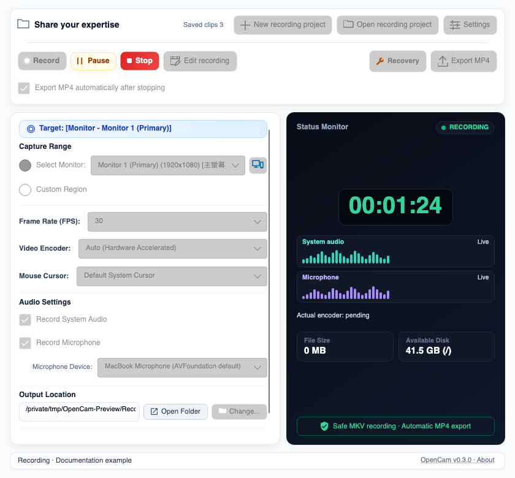
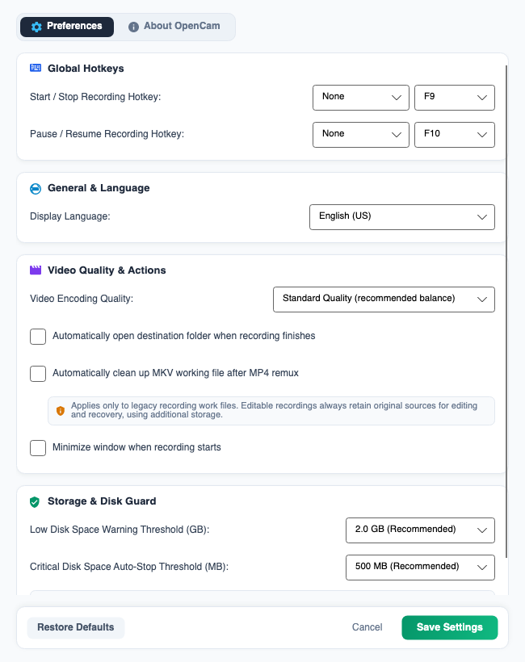
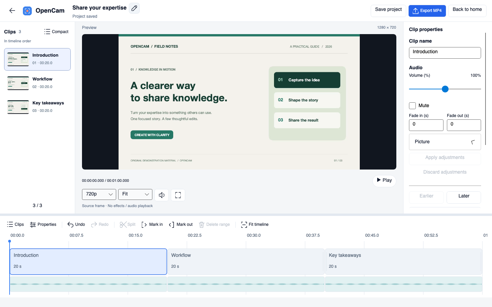

# OpenCam Complete User Guide (English)

## New in v0.2.5: experimental Windows capture

Starting with v0.2.5, Settings → Video Quality & Actions → Windows screen capture offers Compatible capture (GDI), the unchanged default, and Modern capture (experimental).

If the live pointer flickers while the resulting MP4 looks normal, try the experimental mode and compare both the physical screen and the recording. The status panel must say **Desktop Duplication** to confirm it is active; GDI status includes a fallback reason. Initial support requires exactly one hardware graphics adapter with uniquely mapped, unrotated outputs and regions contained in one output. Multiple monitors on that adapter are supported, not limited to two. Multiple hardware GPUs (including headless GPUs), cross-monitor regions, rotated outputs, ambiguous mappings, and missing FFmpeg capabilities use GDI. This avoids selecting the wrong screen when Recorder and FFmpeg have different per-executable GPU preferences.

Change capture mode only while idle, not while paused. Existing audio/cursor controls during pause remain available. Confirmed segments pin their backend and encoder. Output/interactive desktop loss safely stops the recording and preserves working files; unknown startup errors do not trigger blind retries. This implementation downloads GPU frames for compatibility with existing encoders, so it does not promise lower CPU usage. Cursor-flicker resolution, long A/V sync, and affected-PC acceptance still require real Windows hardware.

OpenCam lets you record, edit, and resume recording. It writes MKV sources, retains them alongside a reopenable editing project, and exports MP4 when needed. Crash Recovery can attempt to preserve successfully written recordings; project recovery drafts protect interrupted unsaved edits.

> This guide covers OpenCam v0.3.1, not a claim of completed acceptance. Windows native recording, editor audiovisual preview, export, and long A/V sync acceptance remain pending. Complete corresponding-source verification for Windows FFmpeg also remains pending, and packages are unsigned. Use disposable media; see the [release notes and limitations](https://github.com/kaoshou/OpenCam/blob/master/docs/releases/v0.3.1.md).

v0.3.1 increases the default home height and preserves encoded video for compatible whole, unedited multi-clip exports needing audio normalization. Progress distinguishes inspection, copy, audio conversion, rendering and verification. Temporary PCM requires extra disk space and is cleaned up on completion/cancellation without modifying original MKVs. Unsafe copy cases still require rendering.

### v0.3.0: home and project workflow

1. With no project open, Start recording asks for a name prefilled with the date and time. Confirm creates the project and starts capture; Cancel does neither.
2. With an existing or reopened project, Start appends clips. Auto-export MP4 on stop is on by default for each project. Turn it off to save content on Stop and manually export later.
3. New recording project creates without capturing. Open recording project selects `project.opencam`. The home screen shows the current name and clip count.
4. After a saved pause or completed stop/export, Edit recording opens the current content. The editor handles editing, project saving and MP4 export; returning home retains the project.
5. Active recording blocks editor entry and project creation/opening. A saved pause permits editing, but switching projects requires stopping. Resuming capture hides the editor.
6. Project saved means the editing data was saved, not that an updated MP4 was exported. Retain the entire project folder and sources; do not move only the `.opencam` file.

See the [README](../README.md) for Windows portable testing instructions. Start with short, disposable media: record/pause/resume/stop, edit and undo, save and reopen, append recording, then export MP4 and check audio/video synchronization.

### Editing, preview and saving

- Select clips in the left list or timeline; drag in either area to reorder. Seek in the timeline to trim, split at the playhead, or delete a selected range/whole clip. Undo/redo lets you revise editing operations.
- Clip properties include name, volume (0–200%), mute, fades, crop, scale and position. Apply property changes to commit them to the edit recipe. The pencil beside the title renames the project without moving its folder or original MKVs.
- Preview supports play/pause, seeking, quality selection, a resizable area and fullscreen. Preview sound is on/off, with no separate volume slider; it does not change exported audio. Original-resolution preview is subject to a frame-memory limit. Preview quality does not change export settings.
- Explicit Save commits the editing version. A recovery draft protects interrupted edits; it is not a saved version or an updated MP4. Switching/closing with unsaved changes offers Save, Discard or Cancel. Reopening a recoverable draft offers a restore decision.
- Resolve unsaved changes when prompted before manual export. If the same content has a verified existing output, choose Open Existing, Export Again or Cancel. Export has progress and cancellation controls; cancellation/failure preserves source media.

These are offline renders of the current v0.3.0 UI with illustrative state and an authored demonstration video in the editor, not device-recording acceptance evidence. Select an image for full size.

[](images/preview_main_enus.png)
[](images/preview_settings_enus.png)
[](images/preview_editor_enus.png)

## 1. System Requirements and First Launch

### Windows

- Windows 10 or Windows 11, x64.
- Both the installer and portable package include the required runtime components.
- Download `OpenCam_v0.2.5_Windows_x64_Setup.exe` or `OpenCam_v0.2.5_Windows_x64_Portable.zip` from [Releases](https://github.com/kaoshou/OpenCam/releases). Filenames identify the version, Windows platform, and x64 architecture.
- System audio uses Windows loopback capture. A microphone can be selected in OpenCam.

### macOS

- macOS 13 Ventura or later.
- The official build currently supports Apple Silicon (arm64). An Intel Mac (x64) build is not currently provided.
- Download `OpenCam_v0.2.5_macOS_arm64.dmg` from [Releases](https://github.com/kaoshou/OpenCam/releases); arm64 identifies Apple Silicon.
- After first launch, open **System Settings → Privacy & Security** and allow OpenCam to use:
  - Screen & System Audio Recording
  - Microphone, when microphone recording is needed
- If a permission change does not take effect immediately, quit OpenCam completely and reopen it.
- On macOS, OpenCam uses the current system-default input device. To use a different microphone, select it in macOS Sound settings before recording. You can also change the default device while paused and then resume.

## 2. Quick Start

1. Under **Capture Range**, select **Monitor** or **Custom Rectangle**.
2. Select the FPS, encoder, and cursor style. If needed, choose the default quality in Preferences first.
3. Choose whether to record system audio and the microphone.
4. Confirm that the output location has at least 1 GB of free space.
5. Select **Start Recording**. OpenCam immediately locks settings that must not change, including while it is preparing the recording.
6. While recording, you can pause, resume, or stop. Pause first if you need to change the audio switches or cursor style.
7. After **Stop Recording**, wait for the sources to be saved and, if auto-export is on, for MP4 export to finish. With auto-export off, no new MP4 is expected; manually export later.

If you try to close the window while OpenCam is preparing, recording, or paused, it displays a warning and cancels the close request. Stop the recording and wait for finalization before closing the application.

If the operating system terminates the UI or it exits abnormally, the background Recorder detects that its parent process has gone away, safely stops and closes the current MKV, attempts finalization, and then exits. It does not keep recording unnoticed after the UI disappears. If finalization did not finish, reopen OpenCam and use **Crash Recovery**.

If startup status cannot be confirmed, settings remain locked but **Stop** is available for a safe-stop attempt. Only if that attempt fails does the close warning offer **Force Quit…**, followed by a second confirmation. Force quitting may interrupt MKV writing. If no MP4 appears after reopening, run **Crash Recovery** using the original output location. An ordinary click on the window close button never forces the recorder to quit.

## 3. Recording Modes

### Monitor

Records the complete image from the selected display. If multiple displays are connected, choose one from the monitor list.

If you are unsure which physical display is “Monitor 1/2/3…”, select monitor mode and click the compact **Identify Displays** icon to the right of the monitor list (hover for its tooltip). OpenCam briefly shows the matching number on every connected display, highlighting the selected one. This works with any number of displays. If geometry or scaling makes a match uncertain, OpenCam omits that label and shows a notice rather than risk identifying the wrong screen. Labels are dismissed when recording preparation begins and do not appear in the video.

“Complete image” means the entire selected monitor; OpenCam does not combine all displays into one video. The monitor source is locked after recording starts. Stop the current recording before switching displays.

### Custom Rectangle

This mode opens a selection frame for defining the exact area to record. The inside of the frame is transparent so that you can see the content that will be captured.

- Drag the body of the frame to move the region.
- Drag an edge or corner to resize it.
- Press Enter to confirm the region.
- Press Esc to cancel selection.

OpenCam converts the region to physical screen pixels and, when necessary, adjusts it to even dimensions accepted by the encoder. The region can only be changed before recording starts.

## 4. Recording Parameters and Main Window Options

### FPS

- **30 FPS**: Recommended for tutorials, presentations, meetings, and long recordings. It uses fewer resources and produces smaller files.
- **60 FPS**: Suitable for fast motion, animation, or content that benefits from smoother movement, but increases CPU/GPU load and file size.

### Encoder

- **Auto**: Recommended. OpenCam prefers an available hardware encoder and falls back to CPU encoding when necessary.
- **CPU (libx264)**: Highly compatible, but generally uses more CPU.
- **Hardware encoding**: Depending on the platform and hardware, OpenCam may use NVIDIA NVENC, Intel QSV, AMD AMF, or Apple VideoToolbox.

The following encoder diagnostics are available starting with v0.2.4:

- **Auto does not guarantee hardware encoding.** Windows validates NVENC → QSV → AMF; macOS validates VideoToolbox. The first successful candidate is selected. An unavailable explicitly requested encoder falls back to CPU, not another hardware vendor.
- Look for **Actual encoder** below the audio meters in the right-hand status panel. It is pending before startup; after startup it reports the Recorder's actual libx264 (CPU), NVENC, QSV, AMF, or VideoToolbox selection, including the CPU fallback reason. The user's Auto preference is not replaced.
- Each probe has a 3-second limit, within a 9-second overall work budget, with up to 2 additional seconds for required cleanup. Successful results are cached for 10 minutes; failures cool down for 30 seconds. An FFmpeg file change or hardware startup failure invalidates relevant successful results. Cancellation does not permanently mark hardware unavailable.
- A failed hardware start permits **one CPU retry only before the first successful segment**. After that, the session keeps its actual encoder, including after paused audio/cursor changes. A failed resume retains valid segments and the paused state: retry or Stop to finalize them. Use recovery after an interruption. Failed candidates never overwrite existing files or enter the normal concatenation list.
- [Application logs](#settings-file-and-application-logs) distinguish successful probes, nonzero exits, timeouts, cancellation, and failure to launch, as well as cache/fallback decisions. A failed or timed-out probe does **not establish that integrated graphics lack support**. Check paths and device details before sharing logs.

Real Windows CPU comparisons and recording-time cursor flicker remain unverified on affected hardware. This stage does not replace GDI capture or claim a flicker fix or measured performance gain. It does not silently reduce resolution, FPS, or quality.

After successful process cleanup, unconfirmed failed attempts are retained in the same session directory as `failed_attempt_*.mkv` for diagnosis or expert manual inspection, not automatic concatenation into normal or recovered output. Cleanup or quarantine failure blocks another launch. Confirmed segments and unknown crash-time working files retain the existing recovery behavior.

### Quality

- The default quality is selected in Preferences and applies when the next recording starts.
- **Ultra**: Highest visual quality, with larger files and potentially higher encoding load.
- **Standard**: The default and recommended general-purpose choice, balancing clarity, load, and storage.
- **Compact**: Smaller files for limited storage or long recordings, with less visual detail.

Encoders use different quality-control methods, so the same preset does not guarantee an identical bitrate or file size on every computer.

### Cursor Style

- **Native cursor**: Keeps the normal pointer appearance.
- **Yellow halo**: Adds a visible halo around the pointer.
- **Halo and click ripple**: Adds both the halo and visual click feedback.
- **Hidden cursor**: Omits the pointer from the video.

### System Audio and Microphone

The two audio sources can be switched independently, supporting four combinations: no audio, system audio only, microphone only, or both sources.

- **System audio**: Records audio played by the computer. On macOS 13 or later, this uses ScreenCaptureKit.
- **Microphone**: Windows lets you select a device in OpenCam. macOS uses the system-default input device.

Audio settings are initially locked after recording starts. To change system-audio or microphone recording, pause first, make the change, and resume. OpenCam applies the new setting to the next recording segment.

The recording status panel shows separate live level waveforms for **System Audio** and **Microphone**, helping you check whether each input is receiving sound. These are approximate recent volume indicators, not an audio preview or a calibrated meter:

- **Live**: Detectable input level is present.
- **Silent**: The source is being monitored, but its level is very low or zero.
- **Off**: This source is not enabled for the current segment.
- **Paused**: Recording is paused; the waveform does not imply active capture and refreshes after resuming.
- **Unavailable**: Live level data cannot currently be obtained. This does not prove the recorded track is silent; if it persists, stop and inspect the result and audio device.

The waveforms read only level values from the capture path. They do not store extra raw audio or change the recording.

### Output Location

- **Open Folder**: If a completed recording exists, OpenCam opens the output folder and attempts to select the latest result; otherwise, it opens the folder itself.
- **Change**: Selects a new output folder. This is available only while idle.

Changing the output location also changes where OpenCam scans for recoverable sessions. To recover a recording previously stored elsewhere, first set the output location back to its original output root.

### Minimize When Recording Starts

When enabled, OpenCam minimizes the main window once recording starts so that it does not appear in the captured content.

## 5. Recording, Pausing, and Locked Settings

As soon as **Start Recording** is selected, OpenCam locks the capture source, monitor, region, FPS, encoder, quality, output location, and other fixed options—even while the recording is still being prepared. This prevents a last-second change from appearing to affect a recording that is already being created.

While paused, only the following items can be changed:

- Whether to record system audio
- Whether to record the microphone, including microphone selection on Windows
- Cursor style

All other recording settings remain locked. Resuming creates the next MKV segment with the updated settings; a saved paused segment may also be edited. Stop saves the project and exports according to the per-project auto-export option. Pausing does not end the overall recording session.

## 6. Recording Mechanism and File Safety

The interface and recording engine run as separate processes. v0.3.0 retains original MKVs inside the project; edits change a recipe without rewriting sources. A new project contains:

```text
<project folder>/
├── project.opencam
├── sources/
├── sessions/Sessions/<session ID>/  # MKV segments and session data
├── cache/
└── exports/
```

Each pause safely finishes and saves the current segment; resuming creates the next one. Back up the whole folder: `project.opencam` alone does not include source media. Older non-project recordings may still use `<output location>/Sessions/`, with `segment_*.mkv` or `recording.mkv`.

On a normal stop, the project workflow is:

1. Asks FFmpeg to stop safely and finalize the current MKV.
2. Checks that the working media is readable.
3. Saves the project, then exports the current timeline if auto-export is on. Compatible complete clips may preserve encoded video, with audio conversion when needed. Trims, effects, incompatible streams or unavailable packet timing require rendering.
4. Validates the MP4 with FFprobe.
5. Saves a result including a sanitized project name, without overwriting existing results. Check the completion message for the actual output location.

Original project MKVs must be retained for reopening, editing and continued recording. The older **Delete working files after successful remux** setting does not permit deleting project sources. Do not remove MKVs from the project after exporting an MP4.

### Disk-Space Protection

- At least 1 GB of free space is required to start recording.
- OpenCam checks the remaining space periodically while recording.
- It warns the user at the configured warning threshold.
- At the critical threshold, it attempts a safe stop before the disk is completely exhausted.

## 7. Preferences Reference

### General and Language

- **Language**: Traditional Chinese or English (US).
- **Open output folder when recording finishes**: Opens the output location after an MP4 is created successfully.
- **Minimize when recording starts**: The same option shown on the main window.

### Hotkeys

Default hotkeys:

- F9: Start/stop recording
- F10: Pause/resume recording

Available keys include F1–F12, R, S, P, Space, Insert, and Home. They can be combined with Ctrl, Alt, Shift, and selected modifier combinations. Start/stop and pause/resume cannot use exactly the same combination.

> Global hotkeys are currently registered only on Windows. On macOS, use the controls in the OpenCam window. A visible hotkey preference does not mean that it can trigger OpenCam while another macOS application is in the foreground.

### Default Quality

Sets new recordings to Ultra, Standard, or Compact by default. Changing this preference does not alter the fixed quality of a session that has already started.

### Delete Working Files After Successful Remux

This setting belongs to the older non-project recording flow. v0.3.0 project sources are retained after successful export.

In the legacy flow it is off by default; enabling it clears non-project working files after successful remux. v0.3.0 original project segments remain retained.

### Disk Warning and Critical Thresholds

- Warning choices are 1, 2, 5, or 10 GB; the default is 2 GB.
- Critical choices are 200, 500, or 1000 MB; the default is 500 MB.
- The warning threshold must be higher than the critical threshold. If OpenCam reads an invalid or malformed legacy setting, it restores the safe defaults of 2 GB and 500 MB.
- Regardless of these thresholds, starting a recording always requires at least 1 GB of free space.

### About

Displays the current version, licensing information, and a link to the GitHub project. This tab does not change recording settings.

From 0.2.0 onward, OpenCam's project-owned source code is licensed under [AGPL-3.0-or-later](../LICENSE). Download packages include the complete `LICENSE` and a `SOURCE.txt` link to the corresponding source revision. FFmpeg and other third-party components retain their own licenses; earlier releases are not retroactively relicensed.

## 8. Result, Working File, Settings, and Log Locations

### Default Output Locations

| Platform | Default location |
| --- | --- |
| Windows | `C:\Users\<account>\Videos\ScreenRecordings` |
| macOS | `/Users/<account>/Movies/ScreenRecordings` |

**Change** selects the root for new projects and the manual-export destination; an already-open project retains its folder. Project recordings live in its `sessions/Sessions/` directory; legacy non-project sessions use `Sessions/` under the output root.

### Session Contents

The following location describes legacy non-project sessions. For v0.3.0, inspect `sessions/Sessions/<session ID>/` inside the project and retain the whole project.

```text
<output location>/Sessions/<session ID>/
├── session.json
├── segment_000.mkv
├── segment_001.mkv
├── recording.log
└── recovery.json        # Appears after a recovery attempt
```

Some sessions may also contain `session.json.bak`. `.recovery.lock` is a temporary lock used to prevent multiple OpenCam instances from recovering the same data simultaneously.

### Settings File and Application Logs

| Type | Windows | macOS |
| --- | --- | --- |
| Settings | `%LOCALAPPDATA%\ScreenRecorder\user_settings.json` | `~/Library/Application Support/ScreenRecorder/user_settings.json` |
| Log directory | `%LOCALAPPDATA%\ScreenRecorder\Logs` | `~/Library/Application Support/ScreenRecorder/Logs` |

Do not edit the settings file while OpenCam is running. When reporting a problem, the session's `recording.log` and the application logs are useful, but first check them for paths or device names you do not want to share.

## 9. When to Use Crash Recovery

This section covers session MKV recovery, not edit-draft restoration. After a v0.3.0 interruption, retain the whole project and reopen `project.opencam`; the draft prompt restores edits only. The root-scan steps below describe legacy non-project recordings. Project sessions live under `<project>/sessions/Sessions/`, so their recovery root is `<project>/sessions`. Recovering an MP4 does not restore project edits.

Crash Recovery is appropriate when:

- OpenCam or FFmpeg crashes during recording.
- The computer loses power, restarts, or the application is forcibly terminated.
- Finalization is interrupted and no final MP4 is produced.
- OpenCam reports a recoverable session after it is reopened.

Do not use it when:

- A recording is still active or paused.
- The MP4 completed successfully and you only want to edit it or repair an unrelated video.
- You need a general-purpose video converter.

At startup, OpenCam scans the `Sessions` directory under the current output location. To avoid mistaking an active recording for an interrupted one, a session with a heartbeat in the last 15 seconds is not offered for recovery. After an abnormal exit, reopen OpenCam and allow a short time for the scan to update.

### Running Crash Recovery

1. Confirm that no recording is still running.
2. If the recording used a custom output location, set OpenCam back to that folder.
3. Wait for the scan to finish. If recoverable data is found, the **Crash Recovery** control shows the number of sessions available.
4. Select **Crash Recovery** and wait for all sessions to finish processing.
5. Recovered results are written to the output root as `Recovered_<session ID>.mp4`, with a numeric suffix when needed.

Recovery probes the MKV segments, skips empty, damaged, or unreadable entries, and first attempts to join all valid content. If the complete join fails, OpenCam progressively removes damaged trailing segments to salvage the longest readable continuous prefix. A result may therefore be marked as a partial recovery and omit the final damaged content.

Crash Recovery does not delete the original MKV files. If `session.json` is missing or corrupt, OpenCam also attempts to reconstruct the required information from surviving segments.

## 10. Manually Finding and Preserving an Incomplete Recording

For v0.3.0, back up the whole project first; its sessions live under `<project>/sessions/Sessions/`. The `<original output location>/Sessions/` path below describes legacy non-project recordings.

If OpenCam does not yet show a recoverable session, or if you want to make a backup first:

1. Confirm that OpenCam and its recording engine have stopped. Never move working files while a recording is active.
2. Open `<original output location>/Sessions/`.
3. Find the session directory corresponding to the recording time.
4. Copy the entire directory to another safe location. Preserve `segment_*.mkv`, `session.json`, `recording.log`, and all other files without first renaming or overwriting the originals.
5. Reopen OpenCam, restore the original output root, wait longer than 15 seconds, and then run **Crash Recovery**.

The final MKV may be unplayable if it was interrupted before finalization; this does not mean the earlier segments are lost. Unless you are familiar with FFmpeg concatenation, timestamps, and audio-stream consistency, let OpenCam attempt automatic recovery before modifying any original segment.

If no recoverable content appears, check the following in order:

- The selected output location is the original root used for that recording.
- At least 15 seconds have passed since the interruption, or OpenCam has been restarted.
- `segment_*.mkv` or the legacy `recording.mkv` exists and is larger than 0 bytes.
- `recording.log` and the application logs do not report a disk, permission, FFmpeg, or device error.

## 11. Troubleshooting

### Recording Does Not Start

- Confirm that the output directory exists and is writable.
- Confirm that the disk has at least 1 GB of free space.
- On macOS, verify Screen Recording permission and restart OpenCam after changing it.
- Try 30 FPS, Standard quality, and the Auto encoder.
- Check the application logs for FFmpeg or encoder errors.

### No System Audio or Microphone on macOS

- System audio requires macOS 13 or later and Screen & System Audio Recording permission.
- The microphone requires Microphone permission and uses the current macOS default input device.
- For intermittent audio, first reduce system load with 30 FPS, Standard quality, and Auto encoding, and confirm that the default input device has a stable connection. If it continues, preserve the logs and a short test video for diagnosis.

### No MP4 Appears After Stopping

- Check the current project's auto-export-on-stop switch first. With it off, Stop saves the project only; use manual export.

- Validation and remuxing continue after the stop request. Long or multi-segment recordings take longer.
- Do not forcibly close OpenCam during finalization.
- Check both the output root and the matching `Sessions` directory.
- If finalization was interrupted, reopen OpenCam and use Crash Recovery.

### The Custom Region Cannot Be Resized

- The selection frame can be reopened and adjusted only while OpenCam is idle and **Custom Rectangle** is selected.
- The region locks immediately after recording starts. Stop the recording before changing it.

### Open Folder Does Nothing

- Confirm that the configured output path still exists and is accessible to the current account.
- If it points to a disconnected external drive or network location, change it to a valid local folder.
- Check the status area and application log for the folder-opening error.

## 12. Safe-Use Recommendations

- Before an important or long recording, make a short test and verify the picture, system audio, and microphone.
- Keep ample free disk space for long sessions and prevent the computer from sleeping automatically.
- Do not force-quit OpenCam, disconnect the output drive, or delete `Sessions` content while recording.
- Manually remove MKV working files only after the final MP4 exists and plays correctly.
- Before recording other people, meetings, copyrighted material, or confidential information, ensure that you comply with applicable laws and permissions.

### Reading Recorder Health

- A live waveform means OpenCam is receiving level samples; a flat line in a quiet room does not by itself mean failure.
- Health may remain unknown during startup, immediately after resume, or whenever there is not enough evidence. This conservative state is not a confirmed failure.
- A **Recorder health warning** means the working file or frames stopped progressing repeatedly, the encoder reported an error, or a selected audio source has no usable samples. Check the preview and meters; if the warning persists, stop safely and preserve the Session and logs.

Return to the [README](../README.md) | [繁體中文使用說明](USER_GUIDE.zh-TW.md)
