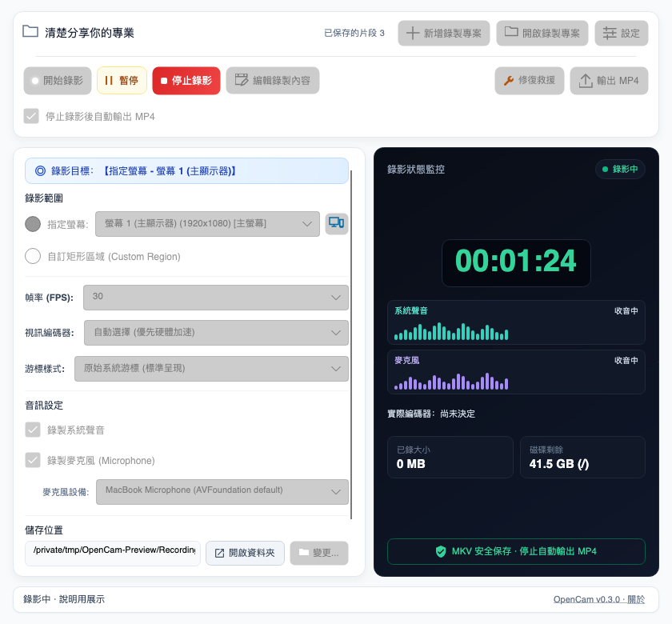

# OpenCam 完整使用說明（繁體中文）

OpenCam 讓你錄影、剪輯，再繼續錄影。錄影期間先寫入 MKV，剪輯以專案保存並保留原始素材，可稍後重新開啟、追加錄影及輸出 MP4。若遇到中斷，「修復救援」可嘗試保留已成功寫入的錄影；未儲存剪輯則使用專案復原草稿。

> 本說明適用於 OpenCam v0.3.0 開發分支，不表示已發布或全部驗收通過。Windows 原生錄影、編輯影音預覽、輸出及長時間音畫同步仍待實機驗收；Windows FFmpeg 完整對應原始碼核對尚未完成，套件未簽章。請用可拋棄素材測試。詳見 [預定更新與發布門檻](https://github.com/kaoshou/OpenCam/blob/master/docs/releases/v0.3.0.md)。

### v0.3.0：主畫面與專案流程

1. 沒有開啟專案時，按「開始錄影」會先詢問名稱並預填日期時間；確認後建立專案及錄影，取消不錄影。
2. 已開啟或重新開啟專案時，按「開始錄影」會往末尾增加片段。每個專案的「停止後自動輸出 MP4」預設開啟；關閉後停止只保存內容，之後可手動輸出。
3. 主畫面提供「新增錄製專案」（只建立，不立即錄影）與「開啟錄製專案」（選擇 `project.opencam`），並顯示目前專案名稱及片段數。
4. 暫停保存後或停止封裝完成後，可按「編輯錄製內容」。編輯器只負責剪輯、儲存專案與輸出 MP4，返回主畫面不會關閉目前專案。
5. 錄影中禁止進入編輯器、新增或開啟專案。暫停時可以編輯，但必須停止錄影後才能切換專案；恢復錄影會收起編輯器。
6. 「專案已儲存」只表示剪輯資料已保存，不代表已輸出最新 MP4。請保留整個專案資料夾及其來源素材，不要只搬移 `.opencam` 檔。

Windows 下載與免安裝測試步驟請見 [README](../README.md)。建議先測試短片：錄影／暫停／繼續／停止、剪輯與復原、儲存後重新開啟、追加錄影、最後輸出 MP4 並檢查聲音與畫面同步。

### 剪輯、預覽與儲存

- 點選左側片段或時間軸片段進行選取；兩處均可拖曳排序。用時間軸定位，再修剪、於播放頭分割，或刪除選取範圍／整個片段。可用復原／重做修正操作。
- 右側屬性可改片段名稱、音量（0–200%）、靜音、淡入／淡出、裁切、縮放與位置；修改後按套用。標題旁鉛筆可改專案名稱；改名不移動資料夾或來源 MKV。
- 預覽可播放／暫停、跳轉時間，選擇預覽畫質，調整預覽區大小及全螢幕。預覽聲音只有開／關，沒有獨立音量滑桿；此開關不改輸出聲音。原始畫質選項受影格記憶體限制，預覽畫質不改變輸出設定。
- 按「儲存專案」才把剪輯當作已儲存版本。復原草稿是中斷保護，不等於已儲存，也不等於最新 MP4。切換／關閉流程遇到未儲存修改時可選儲存、捨棄或取消；重開遇到復原草稿時可選是否復原。
- 手動輸出前依提示處理未儲存修改。若相同內容已有可驗證的輸出，可開啟既有結果、重新輸出或取消。輸出有進度及取消控制；取消／失敗不應刪除原始素材。

以下圖片是 v0.3.0 真實 UI 離線渲染展示；編輯器使用自行製作的示範影片，不代表實機錄影驗收。點選可看原尺寸。

[](images/preview_main_zhtw.png)
[](images/preview_settings_zhtw.png)
[](images/preview_editor_zhtw.png)

## 1. 系統需求與首次啟動

### v0.2.5：Windows 游標閃爍測試模式

v0.2.5 起在「設定 → 錄影品質與行為 → Windows 畫面擷取」提供「相容擷取（GDI）」及「新版擷取（測試）」。預設仍為 GDI；如果錄影時實體螢幕游標閃爍、但 MP4 正常，可嘗試新版模式，再錄相同內容比較實體螢幕及 MP4。

錄影後查看右側「實際擷取」。顯示 Desktop Duplication 才代表採用新版；顯示 GDI 時請看回退原因。初版支援只有一個硬體圖形裝置時，其上的多個未旋轉螢幕，各次選一台或其內部選區；多硬體 GPU（含未接螢幕的 GPU）、跨螢幕、旋轉、不明對應或缺少 FFmpeg 能力時採 GDI。這可避免 OpenCam 與 FFmpeg 的個別 GPU 偏好不同而錄錯螢幕。模式僅能於待機修改，暫停時仍不能改；音源與游標原有暫停調整不變。

新版採 CPU 可處理影格再交給既有編碼器，不保證 CPU 更低。首段前明確的新版初始化失敗可安全改用 GDI；未知錯誤不盲目重試。已有有效片段後，輸出失效會停止／保留片段，而非偷偷換模式；必要時再用修復救援處理工作檔。實機閃爍、長時間音畫同步與多 GPU 驗收仍待完成。

### Windows

- Windows 10 或 Windows 11，x64。
- 安裝版與免安裝版都已包含執行所需元件。
- 在 [Releases](https://github.com/kaoshou/OpenCam/releases) 下載 `OpenCam_v0.2.5_Windows_x64_Setup.exe` 或 `OpenCam_v0.2.5_Windows_x64_Portable.zip`。檔名會標示版本、Windows 及 x64 架構。
- 系統音訊使用 Windows 音訊回送擷取；麥克風可在 OpenCam 中選擇。

### macOS

- macOS 13 Ventura 或以上。
- 官方版本目前支援 Apple Silicon（arm64）；尚未提供 Intel Mac（x64）版本。
- 在 [Releases](https://github.com/kaoshou/OpenCam/releases) 下載 `OpenCam_v0.2.5_macOS_arm64.dmg`；檔名中的 arm64 表示 Apple Silicon。
- 第一次啟動後，請到「系統設定 → 隱私權與安全性」允許 OpenCam 使用：
  - 螢幕與系統音訊錄製
  - 麥克風（需要錄製麥克風時）
- 權限變更後若沒有立即生效，請完全結束 OpenCam，再重新開啟。
- macOS 的麥克風來源是系統目前的預設輸入裝置。若要換麥克風，請先到 macOS「聲音」設定切換預設輸入裝置，再開始錄影；也可在暫停期間切換後再繼續錄影。

## 2. 快速開始

1. 在「錄製範圍」選擇「指定螢幕」或「自訂矩形區域」。
2. 選擇 FPS、編碼器與游標樣式；如有需要，先在偏好設定選擇預設畫質。
3. 決定是否錄製系統聲音及麥克風。
4. 確認儲存位置至少有 1 GB 可用空間。
5. 點選「開始錄影」。從準備錄影開始，會立即鎖定不應再變更的選項。
6. 錄影中可暫停、繼續或停止。若需要變更音訊開關或游標樣式，請先暫停。
7. 點選「停止錄影」後，等待素材保存；自動輸出開啟時再等待 MP4 輸出完成。關閉自動輸出時，沒有新 MP4 是正常的，稍後可手動輸出。

錄影初始化、錄影或暫停期間若按下視窗關閉按鈕，OpenCam 會顯示提醒並取消關閉。請先停止錄影並等候封裝完成，再關閉程式。

若 UI 被作業系統強制結束或異常消失，背景 Recorder 會偵測父行程已離開，安全停止並收尾目前的 MKV，再嘗試完成封裝後退出；不會在 UI 消失後繼續無人監看的錄影。若封裝未完成，重開 OpenCam 後使用「修復救援」。

若啟動錄影後長時間無法確認狀態，OpenCam 仍會鎖定設定，但會允許按「停止」嘗試安全結束。若連安全停止都失敗，關閉提醒才會提供「強制結束…」，點選後還需再次確認。強制結束可能中斷 MKV 寫入；重新開啟後若沒有 MP4，請在原儲存位置使用「修復救援」。一般按 X 不會直接強制結束。

## 3. 錄影模式

### 指定螢幕

錄製所選顯示器的完整畫面。若電腦連接多個顯示器，可從清單中選擇其中一個。

不確定「螢幕 1／2／3…」分別是哪一台時，先選擇「指定螢幕」，再按螢幕清單右側的小型「辨識螢幕」圖示（滑鼠停留可看提示）。OpenCam 會短暫在每台已連接的顯示器上顯示對應編號，並特別標示目前選中的螢幕；不論連接幾台都依清單編號顯示。若顯示器位置或縮放設定無法可靠對應，OpenCam 會略過不確定的標籤並提示，避免標錯螢幕。辨識標籤不會進入錄影，開始準備錄影時也會關閉。

這裡的「完整畫面」是指所選的單一顯示器，不是把所有顯示器合併成一支影片。開始錄影後，顯示器來源會鎖定；如需更換顯示器，請先停止目前錄影。

### 自訂矩形區域

選擇此模式後，開啟選取框來指定實際錄製範圍。選取框內部是透明的，可看見即將錄製的內容。

- 拖曳框體可移動選區。
- 拖曳邊緣或角落可調整大小。
- 按 Enter 確認選區。
- 按 Esc 取消選取。

OpenCam 會將選區轉換成實際畫面像素，並在必要時調整成編碼器可接受的偶數尺寸。選區只能在尚未開始錄影時修改。

## 4. 錄影參數與主畫面選項

### FPS

- **30 FPS**：一般教學、簡報、會議及長時間錄影的建議值，資源與檔案大小較低。
- **60 FPS**：適合快速移動、動畫或需要更流暢畫面的內容，但會增加 CPU／GPU 負載與檔案大小。

### 編碼器

- **自動**：建議選項。OpenCam 會優先選擇可用的硬體編碼器，若不可用則回退至 CPU 編碼。
- **CPU（libx264）**：相容性高，但通常使用較多 CPU。
- **硬體編碼**：依平台與電腦硬體，可能使用 NVIDIA NVENC、Intel QSV、AMD AMF 或 Apple VideoToolbox。

v0.2.4 起提供以下編碼器診斷改善：

- **自動不保證硬體加速**：Windows 按 NVENC → QSV → AMF、macOS 按 VideoToolbox 依序驗證，第一個成功者才用於錄影。指定硬體失敗則回 CPU，不改選其他品牌。
- 在右側「錄影狀態監控」的音量波形下方查看**實際編碼器**。開始前顯示「尚未決定」；開始後以 Recorder 的結果顯示 libx264 (CPU)、NVENC、QSV、AMF 或 VideoToolbox，CPU 回退會附上原因。選單中的「自動」仍保持原設定。
- 單一探測最多 3 秒，整輪工作預算 9 秒，必要清理另最多 2 秒。成功結果快取 10 分鐘、失敗冷卻 30 秒；FFmpeg 檔案改變或硬體正式啟動失敗會失效相關成功結果。取消不等於不支援，也不會永久停用硬體。
- **只有第一段尚未成功開始時**，硬體啟動失敗才容許一次 CPU 重試。首段成功後整場固定實際編碼器；暫停改音源或游標仍可繼續，但不能混用不同編碼器。續錄失敗時保留已錄片段與暫停狀態，可重試或按停止封裝；程式中斷後再使用修復救援。失敗候選檔不覆寫既有內容，也不加入正常合併清單。
- [應用程式日誌](#設定檔與應用程式日誌)會區分探測成功、非零退出、逾時、取消及無法啟動，記錄快取與回退原因。逾時或探測失敗**不能直接解讀為內顯不支援**。分享前請檢查日誌中的路徑或裝置資訊。

Windows 實際 CPU 用量比較及錄影時游標閃爍仍待實機驗證；本階段未更換 GDI 擷取，也不宣稱已修復閃爍或量測到效能增益。錄影解析度、FPS、畫質不會因此自動降低。

啟動失敗且程序已安全清理的未確認片段，保留在同一工作階段目錄的 `failed_attempt_*.mkv`，供診斷或專業人員手動檢視，不會自動接進正常／救援成品。若清理或移存失敗，會阻止下一次啟動；已確認片段與當機時尚未確認的工作檔仍保留原有救援機制。

### 畫質

- 畫質預設值位於偏好設定，會套用到下一次開始的錄影。
- **超高畫質（Ultra）**：畫面最清晰，檔案較大，編碼負載也可能較高。
- **標準（Standard）**：預設且建議的一般用途選項，在清晰度、負載與容量間取得平衡。
- **精簡（Compact）**：檔案較小，適合容量有限或長時間錄影，但細節較少。

不同編碼器採用不同品質控制方式，因此相同的畫質名稱不保證產生完全相同的位元率或檔案大小。

### 游標樣式

- **原始游標**：保留一般游標外觀。
- **黃色光暈**：在游標周圍顯示醒目光暈。
- **光暈與點擊漣漪**：除光暈外，也顯示點擊回饋。
- **隱藏游標**：影片中不顯示游標。

### 系統聲音與麥克風

兩個音訊來源可以獨立開關，因此支援四種組合：無音訊、只有系統聲音、只有麥克風，以及兩者同時錄製。

- **系統聲音**：錄製電腦播放的聲音。macOS 13 以上使用 ScreenCaptureKit。
- **麥克風**：Windows 可在 OpenCam 中選擇裝置；macOS 使用系統預設輸入裝置。

開始錄影後，音訊設定會先鎖定。若要改變系統聲音或麥克風開關，請先暫停，修改後再繼續；OpenCam 會從新的錄影片段套用設定。

錄影狀態區會分別顯示「系統聲音」及「麥克風」的即時音量波形，用來確認目前的輸入是否有聲音。這是最近音量的概略指示，不是音訊內容預覽或精準的音量表：

- **收音中**：該來源目前有可偵測的音量。
- **無聲**：正在監測該來源，但目前音量很低或沒有聲音。
- **關閉**：這段錄影未啟用該來源。
- **已暫停**：錄影暫停中，波形不代表正在錄音；繼續後會重新取得資料。
- **無法監測**：即時音量資料暫時不可用。這不等於已證實音軌無聲；若持續出現，請停止後檢查成品與音訊裝置。

波形僅讀取錄音管線產生的音量數值，不會額外保存原始音訊，也不會改變錄影內容。

### 儲存位置

- **開啟資料夾**：若已有完成的錄影，會開啟儲存資料夾並盡可能選取最近的成品；否則直接開啟資料夾。
- **變更**：選擇新的輸出資料夾，只能在閒置時使用。

變更儲存位置也會改變 OpenCam 搜尋修復工作階段的位置。若要救援以前儲存在其他位置的錄影，請先把儲存位置切回原本的輸出根目錄。

### 開始錄影時最小化

啟用後，正式開始錄影時會將 OpenCam 主視窗最小化，避免主視窗出現在錄製內容中。

## 5. 錄影、暫停與選項鎖定

點選「開始錄影」後，即使畫面仍顯示正在準備，OpenCam 也會立即鎖定錄影來源、顯示器、選區、FPS、編碼器、畫質、儲存位置及其他固定選項，避免使用者誤以為臨時變更會套用到正在建立的錄影。

錄影暫停後，只有以下項目可修改：

- 是否錄製系統聲音
- 是否錄製麥克風（以及 Windows 的麥克風選擇）
- 游標樣式

其他錄影設定仍會保持鎖定。繼續錄影時，OpenCam 建立下一個 MKV 分段並套用上述新設定；已保存的暫停片段也可進入編輯器。停止保存專案，並依每個專案的自動輸出選項產生 MP4。暫停本身不會結束整個工作階段。

## 6. 錄影機制與檔案安全

OpenCam 的介面與錄影引擎是分開的處理程序。v0.3.0 的原始 MKV 保存在專案內；剪輯只修改配方，不覆寫來源。新專案包含：

```text
<專案資料夾>/
├── project.opencam
├── sources/
├── sessions/Sessions/<工作階段 ID>/  # MKV 分段及工作階段資料
├── cache/
└── exports/
```

每次暫停安全結束目前分段並保存，繼續時建立下一段。請備份整個專案資料夾；只複製 `project.opencam` 不包含來源影音。舊版非專案錄影仍可能位於 `<儲存位置>/Sessions/`，使用 `segment_*.mkv` 或 `recording.mkv`。

正常停止時的專案流程如下：

1. 通知 FFmpeg 安全停止並完成目前 MKV。
2. 檢查工作檔是否可讀。
3. 保存專案；若開啟自動輸出則輸出目前時間軸。相容完整片段可快速保留影片編碼，必要時轉碼音訊；修剪、效果、不相容串流或無法確認封包時序會重新渲染。
4. 使用 FFprobe 驗證 MP4。
5. 將成品以包含安全化專案名稱的檔名保存，不覆寫既有結果。請依輸出完成訊息查看實際位置。

專案原始 MKV 必須保留，後續重開、剪輯與續錄仍需要它們。舊版「成功封裝後刪除工作檔」設定不代表可以清除專案來源；不要因 MP4 已輸出就刪除專案內的 MKV。

### 磁碟空間保護

- 開始錄影前，儲存磁碟至少需要 1 GB 可用空間。
- 錄影中會定期檢查剩餘空間。
- 到達「警告門檻」時會提醒使用者。
- 到達「臨界門檻」時會嘗試安全停止，避免磁碟完全耗盡而損毀資料。

## 7. 偏好設定說明

### 一般與語言

- **語言**：繁體中文或 English (US)。
- **錄影完成後開啟資料夾**：MP4 成功產生後自動開啟輸出位置。
- **開始錄影時最小化**：與主畫面的同名選項相同。

### 快捷鍵

預設快捷鍵：

- F9：開始／停止錄影
- F10：暫停／繼續錄影

可用按鍵包括 F1–F12、R、S、P、Space、Insert 與 Home，並可搭配 Ctrl、Alt、Shift 及其部分組合。開始／停止與暫停／繼續不能設定成完全相同的組合。

> 全域快捷鍵目前只在 Windows 註冊。macOS 請使用 OpenCam 視窗中的按鈕；快捷鍵欄位即使可見，也不代表能在其他應用程式前景時觸發。

### 預設畫質

設定新錄影預設使用「超高畫質」、「標準畫質」或「高壓縮節省空間」。已經開始的工作階段不會因為變更偏好設定而改變固定畫質。

### 成功封裝後刪除工作檔

此設定屬於舊版非專案錄影流程；v0.3.0 專案來源必須保留，不因一次輸出成功而刪除。

舊版流程預設關閉；開啟會在成功封裝後清除非專案工作檔。v0.3.0 的專案原始片段則保留。

### 磁碟警告與臨界門檻

- 警告門檻可選 1、2、5 或 10 GB；預設 2 GB。
- 臨界門檻可選 200、500 或 1000 MB；預設 500 MB。
- 警告門檻必須高於臨界門檻。若讀到無效或舊版錯誤設定，OpenCam 會回復 2 GB／500 MB 的安全預設值。
- 無論門檻如何設定，開始錄影仍固定要求至少 1 GB 可用空間。

### 關於本程式

顯示目前版本、授權資訊與 GitHub 專案連結。此頁不會改變錄影設定。

自 0.2.0 起，OpenCam 專案自有原始碼採用 [AGPL-3.0-or-later](../LICENSE)。下載包內的 `LICENSE` 是完整條款，`SOURCE.txt` 指向該下載包對應的原始碼版本。FFmpeg 等第三方元件維持各自授權；較早發布的版本不受此次授權變更追溯影響。

## 8. 成品、工作檔、設定與日誌位置

### 預設輸出位置

| 平台 | 預設位置 |
| --- | --- |
| Windows | `C:\Users\<帳號>\Videos\ScreenRecordings` |
| macOS | `/Users/<帳號>/Movies/ScreenRecordings` |

「變更」選擇新專案的建立根目錄及手動輸出目的地；目前開啟的專案仍保留原資料夾。專案原始片段在專案內的 `sessions/Sessions/`，舊版非專案錄影則在輸出根目錄的 `Sessions/`。

### 工作階段內容

以下為舊版非專案工作階段位置。v0.3.0 請查看專案內的 `sessions/Sessions/<工作階段 ID>/`；整個專案都應保留。

```text
<儲存位置>/Sessions/<工作階段 ID>/
├── session.json
├── segment_000.mkv
├── segment_001.mkv
├── recording.log
└── recovery.json        # 執行救援後才會出現
```

部分工作階段也可能有 `session.json.bak`。`.recovery.lock` 是救援期間避免多個 OpenCam 同時處理同一資料的暫時鎖定檔。

### 設定檔與應用程式日誌

| 類型 | Windows | macOS |
| --- | --- | --- |
| 設定檔 | `%LOCALAPPDATA%\ScreenRecorder\user_settings.json` | `~/Library/Application Support/ScreenRecorder/user_settings.json` |
| 日誌目錄 | `%LOCALAPPDATA%\ScreenRecorder\Logs` | `~/Library/Application Support/ScreenRecorder/Logs` |

不建議在 OpenCam 執行中手動修改設定檔。回報問題時，可一併提供相關工作階段中的 `recording.log` 及應用程式日誌，但請先確認其中沒有不希望分享的路徑或裝置名稱。

## 9. 修復救援何時使用

本節描述工作階段 MKV 的修復救援，不是剪輯草稿復原。v0.3.0 中斷後先保留整個專案並重新開啟 `project.opencam`；草稿提示只復原剪輯。下方掃描根目錄步驟適用舊版非專案錄影；專案的工作階段位於 `<專案>/sessions/Sessions/`，檢查救援時應使用其 `<專案>/sessions` 根目錄。成功救出 MP4 不等於專案剪輯已復原。

適合使用修復救援的情況：

- 錄影途中 OpenCam 或 FFmpeg 當機。
- 電腦停電、重新啟動或被強制結束。
- 錄影停止時封裝被中斷，沒有產生最終 MP4。
- 重新開啟後，OpenCam 顯示有可救援工作階段。

不應使用的情況：

- 錄影仍在進行或暫停中。
- MP4 已成功完成，只是想剪輯或修理其他來源的影片。
- 想把修復功能當作一般影片轉檔器。

OpenCam 啟動時會掃描目前儲存位置下的 `Sessions`。為避免把仍在運作的錄影誤判為異常工作階段，最近 15 秒內仍有心跳的工作階段不會列入救援；異常結束後請重新開啟程式並稍候片刻。

### 使用修復救援

1. 確定沒有任何錄影仍在執行。
2. 若原錄影使用自訂儲存位置，先將 OpenCam 的儲存位置切回該資料夾。
3. 等待 OpenCam 完成掃描；若找到內容，主畫面的「修復救援」會顯示可處理數量。
4. 點選「修復救援」，並等待所有工作階段處理完畢。
5. 救援成品會放在輸出根目錄，名稱為 `Recovered_<工作階段 ID>.mp4`；若檔名重複會自動加上序號。

救援會先檢查各 MKV 分段，跳過空白、損壞或無法讀取的項目，再嘗試串接所有有效內容。若完整串接失敗，OpenCam 會逐步移除損壞的尾端分段，盡可能救回前面連續可讀的部分，因此結果可能標示為「部分救回」並缺少最後一段內容。

修復救援不會刪除原始 MKV。即使 `session.json` 遺失或損壞，也會嘗試由現存分段重建必要資訊。

## 10. 手動找到並保全錄到一半的檔案

v0.3.0 專案請先備份整個資料夾，工作階段在 `<專案>/sessions/Sessions/`。以下 `<原儲存位置>/Sessions/` 是舊版非專案路徑。

若 OpenCam 尚未顯示可救援項目，或你想先備份資料：

1. 確認 OpenCam 與錄影引擎都已停止；不要在錄影仍執行時移動工作檔。
2. 開啟 `<原儲存位置>/Sessions/`。
3. 找到對應時間的工作階段資料夾。
4. 將整個資料夾複製到另一個安全位置。保留 `segment_*.mkv`、`session.json`、`recording.log` 與其他檔案，不要先改名或覆寫原檔。
5. 重新開啟 OpenCam，把儲存位置設回原輸出根目錄，等待超過 15 秒後再執行「修復救援」。

最後一個 MKV 可能因異常中止而無法單獨播放，但不代表前面的分段都遺失。除非熟悉 FFmpeg 串接、時間戳與音訊軌一致性，否則建議先讓 OpenCam 自動救援，不要直接修改原始片段。

若仍找不到可救援內容，請依序確認：

- 儲存位置是否為當時錄影使用的原輸出根目錄。
- 是否已在異常結束後等待至少 15 秒或重新啟動 OpenCam。
- `segment_*.mkv` 或舊版 `recording.mkv` 是否存在且檔案大小大於 0。
- `recording.log` 與應用程式日誌是否記錄磁碟、權限、FFmpeg 或裝置錯誤。

## 11. 常見問題排除

### 無法開始錄影

- 確認輸出資料夾存在且可寫入。
- 確認磁碟至少有 1 GB 可用空間。
- macOS 請確認螢幕錄製權限，變更後重新啟動 OpenCam。
- 降低為 30 FPS、標準畫質並使用自動編碼器後再試。
- 查看應用程式日誌中的 FFmpeg 或編碼器錯誤。

### macOS 沒有系統聲音或麥克風

- 系統聲音需要 macOS 13 以上及「螢幕與系統音訊錄製」權限。
- 麥克風需要「麥克風」權限，且使用 macOS 當下的預設輸入裝置。
- 若聲音斷續，先使用 30 FPS、標準畫質與自動編碼器降低系統負載，並確認預設輸入裝置連線穩定；若仍發生，保留日誌與測試影片以便診斷。

### 停止後沒有看到 MP4

- 先檢查目前專案是否關閉「停止後自動輸出 MP4」；關閉時停止只保存專案，請手動輸出。

- 停止後仍需要時間完成驗證與封裝，長錄影或多分段錄影會較久。
- 不要在封裝期間強制結束程式。
- 檢查輸出根目錄與對應的 `Sessions` 資料夾。
- 若封裝被中斷，重新啟動後使用修復救援。

### 自訂區域無法調整

- 只有在閒置狀態且選擇「自訂矩形區域」時才能重新開啟及調整選取框。
- 點選開始錄影後，選區會立即鎖定；請停止後再修改。

### 「開啟資料夾」沒有反應

- 確認設定的輸出路徑仍存在且目前帳號可存取。
- 若路徑位於已拔除的外接磁碟或網路位置，先變更到本機有效資料夾。
- 查看狀態列與應用程式日誌中的開啟失敗訊息。

## 12. 安全使用建議

- 重要或長時間錄影前，先做一段短測試並確認畫面、系統聲音與麥克風。
- 長時間錄影請保留足夠磁碟空間，並避免讓電腦自動睡眠。
- 錄影中不要強制關閉 OpenCam、拔除輸出磁碟或刪除 `Sessions` 內容。
- 只有看到最終 MP4 且能正常播放後，才手動清理 MKV 工作檔。
- 錄影他人、會議、受著作權保護或機密內容前，請確認符合所在地法律與相關授權規定。

### 如何判讀錄影健康狀態

- 即時波形表示 OpenCam 收到音量樣本，但安靜環境下的平線不等於故障。
- 錄影剛開始、剛恢復或尚無足夠資料時，健康狀態可能為未知；這是保守判定，不代表已失敗。
- 狀態區出現「錄影狀態異常」時，代表工作檔/影格連續沒有進度、編碼器回報錯誤，或已選的音訊來源沒有可用樣本。先確認畫面與波形；若警告持續，請安全停止並保存 Session 與 Log。

回到 [README](../README.md) ｜ [English User Guide](USER_GUIDE.en-US.md)
